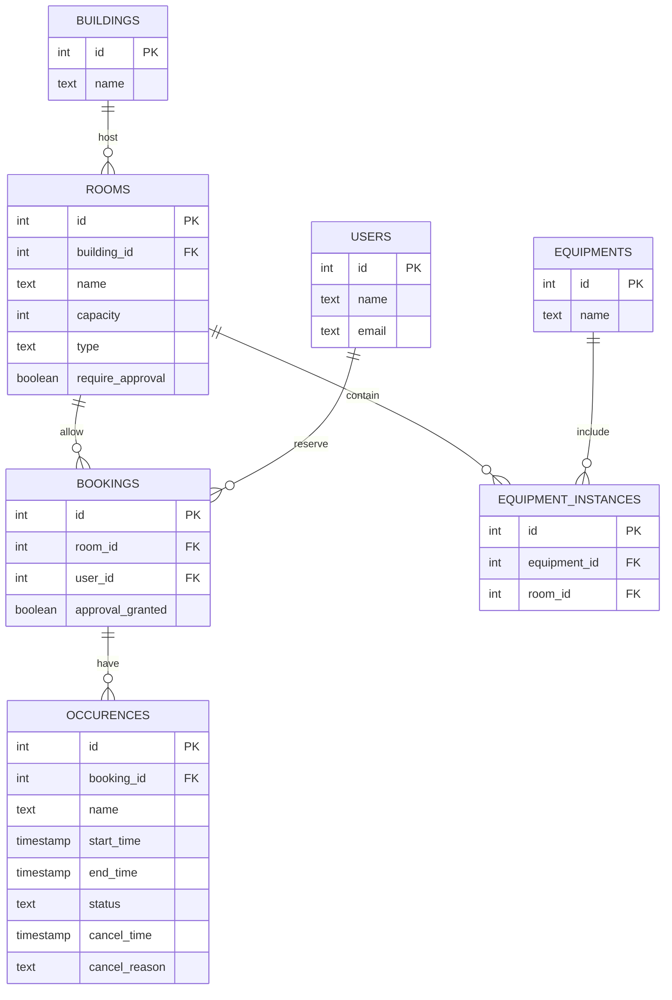

# ER Diagram: Room Booking Service

```mermaid
erDiagram

    BUILDINGS {
        int        id               PK
        text       name
    }

    ROOMS {
        int        id               PK
        int        building_id      FK
        text       name
        int        capacity
        text       type
        boolean    require_approval
    }

    USERS {
        int        id               PK
        text       name
        text       email
    }

    BOOKINGS {
        int        id               PK
        int        room_id          FK
        int        user_id          FK
        boolean    approval_granted
    }

    OCCURENCES {
        int        id               PK
        int        booking_id       FK
        text       name
        timestamp  start_time
        timestamp  end_time
        text       status
        timestamp  cancel_time
        text       cancel_reason
    }

    EQUIPMENTS {
        int        id               PK
        text       name
    }

    EQUIPMENT_INSTANCES {
        int        id               PK
        int        equipment_id     FK
        int        room_id          FK
    }

    BUILDINGS  ||--o{ ROOMS                : "host"
    ROOMS      ||--o{ BOOKINGS             : "allow"
    USERS      ||--o{ BOOKINGS             : "reserve"
    BOOKINGS   ||--o{ OCCURENCES           : "have"
    ROOMS      ||--o{ EQUIPMENT_INSTANCES  : "contain"
    EQUIPMENTS ||--o{ EQUIPMENT_INSTANCES  : "include"
```
