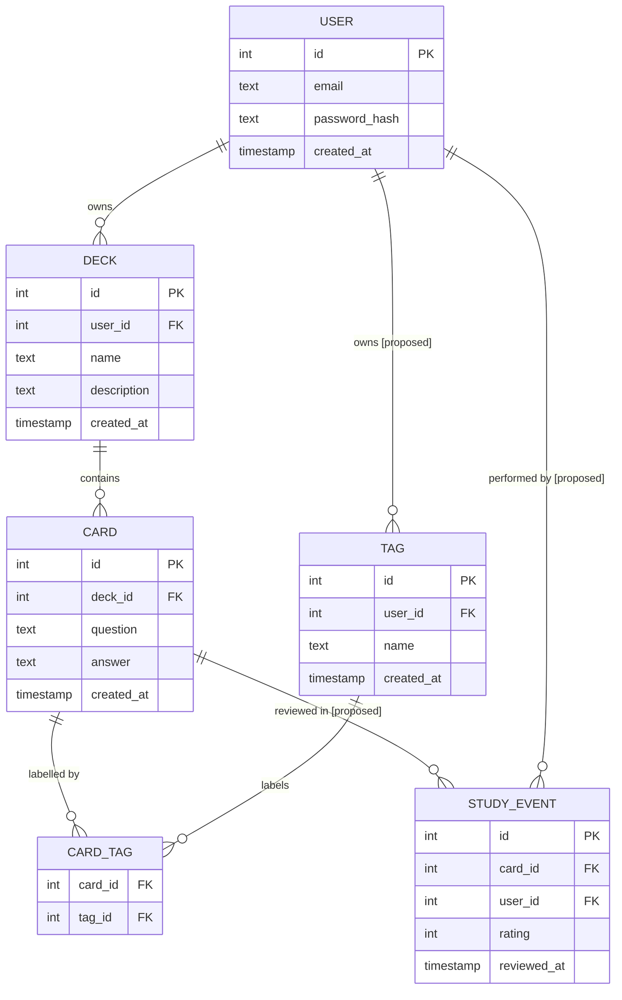

# ER Diagram: Flashcard Study Tracker

The diagram below shows both the entities that exist in the current schema and two entities that a real version would require. Elements that diverge from the current schema are annotated with **[proposed]**.

